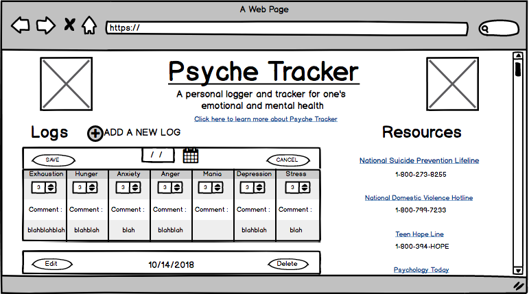

# Psyche Tracker

Psyche Tracker is a personal logger and tracker for one's emotional and mental health.

Check out the [Psyche Tracker Demo](https://psyche-tracker.firebaseapp.com/) here!

 

## Technologies

- [Firebase](https://firebase.google.com/) - Firebase is a backend platform for building Web, Android and IOS applications, it offers a real time database, different APIs, multiple authentication types and hosting.

- [React](https://reactjs.org/) - A library used to craft modern day UI and create views for the front-end in web, client and native applications.

- [Javascript](https://www.javascript.com/) - An object-oriented computer programming language commonly used to create interactive effects within web browsers.

- [JSX](https://reactjs.org/docs/introducing-jsx.html) - A syntax intended to be used by preprocessors to transform HTML-like text found in JavaScript files into standard JavaScript objects that a JavaScript engine will parse.

- [CSS3](http://www.css3.info/) - Cascading Style Sheets is a style sheet language used for describing the presentation of a document written in a markup language.

- [Bootstrap4](https://getbootstrap.com/) - A front-end library for designing websites and web applications. It contains HTML- and CSS-based design templates for typography, forms, buttons, navigation and other interface components, as well as optional JavaScript extensions.

## Minimum Viable Product

The Minimum Viable Product version of the Psyche Tracker web app is a much simplified version of what the final app will be. What follows is the specs for the minimal viable product. A central Kanban board tracking development is located here on [Trello](https://trello.com/b/W5GjPpR9/project-3). For the most up to date developments, take a quick look inside.

 > To learn more about the developer of Psyche Tracker, Tess Craig, visit her [Linkedin](https://www.linkedin.com/in/tessashleycraig/) and view her other [Github](https://github.com/TessACraig89) projects.
