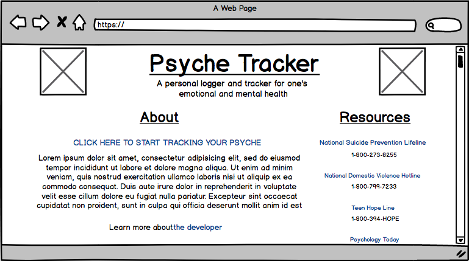
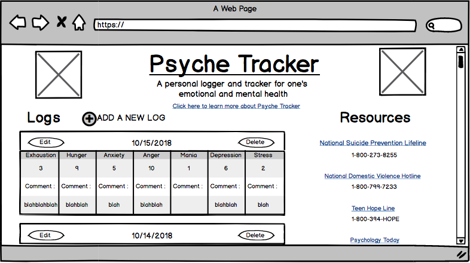
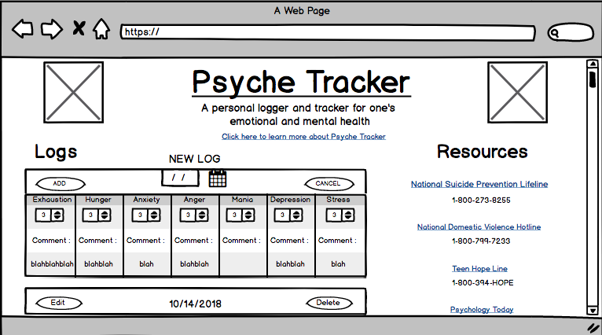

# Psyche Tracker

Psyche Tracker is a personal logger and tracker for one's emotional and mental health.

## Technologies 

- [Firebase](https://firebase.google.com/)

- [React](https://reactjs.org/)

- [React Router](https://reacttraining.com/react-router/web/guides/philosophy)

- [Javascript](https://www.javascript.com/)

- [JSX](https://reactjs.org/docs/introducing-jsx.html)

## Minimum Viable Product 

The Minimum Viable Product version of the Psyche Tracker web app is a much simplified version of what the final app will be. What follows is the specs for the minimal viable product. A central Kanban board tracking development is located here on [Trello](https://trello.com/b/W5GjPpR9/project-3). For the most up to date developments, take a quick look inside.

 ### User Stories

  - As a user, I want to be able to: 
  
    - create a new log

    - choose a date for my log

    - edit my logs

    - save changes that I've made to my logs

    - delete logs

    - choose a number between 1 and 10 to represent my emotional and mental levels for that day

    - comment on each of the levels listed above

    - edit my comments

    - view a chart for each level listed above that tracks the fluctuation between each of my logs

    - view a list of links to various resources 

 ### Wireframes

 #### About Page
 

 #### Logs Page
 

 #### Edit Log View
 

 #### New Log View
 
 
 ## Work In Progress
 
  - editing functionality

  - update funtionality 

  - charts for each level listed that tracks the fluctuation between each log

  - number stepper for ratings

 > To learn more about the developer of Psyche Tracker, Tess Craig, visit her [Linkedin](https://www.linkedin.com/in/tessashleycraig/) and view her other [Github](https://github.com/TessACraig89) projects.
